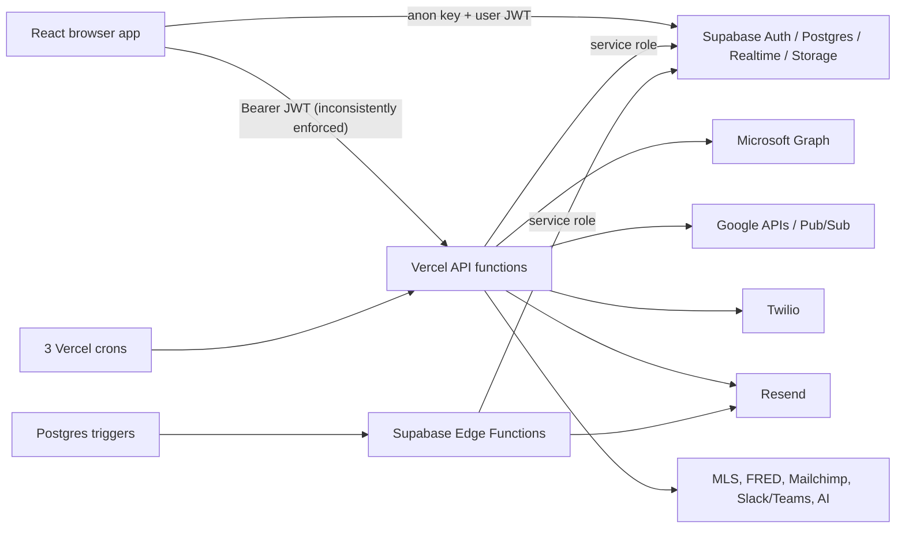

# System Architecture

## Runtime topology

| Layer | Status | Verified implementation |
|---|---|---|
| Browser application | **Verified** | React 18 single-page application, entered through `index.html` → `src/main.jsx` → `src/App.jsx`. |
| Routing | **Verified** | React Router 6 with authenticated application routes, public website routes, a public TV route, and SPA fallback in `vercel.json`. |
| Client data | **Verified** | `@supabase/supabase-js` is used directly from pages, contexts, components, hooks, and `src/lib/db.js`; realtime subscriptions are used for selected tables. |
| Authentication | **Verified** | Supabase Auth password sessions are loaded by `AuthContext`; an `agents` row is resolved first by `auth_user_id`, then by email. |
| API tier | **Verified** | Vercel-style CommonJS functions under `api/`; 53 route handlers plus 17 shared `_lib` modules. |
| Database | **Partially verified** | PostgreSQL/Supabase objects are represented by loose SQL files. The repository does not prove which files were applied or the live schema order/state. |
| Background execution | **Partially verified** | Three Vercel crons are declared, and five Supabase Edge Functions exist. Edge deployment and Edge schedules are not committed. |
| External services | **Verified** | Code paths exist for Supabase, Microsoft Graph, Google APIs, Twilio, Resend, Mailchimp, Slack/Teams webhooks, MLS Grid/SimplyRETS, FRED, OpenAI, Anthropic, Sentry, and PostHog. |
| Hosting | **Partially verified** | `vercel.json` configures Vite build output, SPA rewrites, and crons. The live Vercel project and environment are **Unknown**. |

## Application composition

- **Verified** — `src/main.jsx` initializes Sentry and PostHog and renders `<App />`.
- **Verified** — `src/App.jsx` provides, in order, the top error boundary, `BrowserRouter`, `AuthProvider`, `AppProvider`, and `RootRouter`.
- **Verified** — Authenticated pages render inside `Layout`; global toast, active-call bar, command palette, voice capture, and AI assistant are mounted from the application shell.
- **Verified** — `/tv` and `/public/*` bypass `AppShell` authentication checks by design.
- **Verified** — Per-page errors are actually caught by one boundary surrounding the complete authenticated `<Routes>` collection. The `SafePage` helper described as a per-page boundary exists but is never used.
- **Partially verified** — The application exposes UI permissions through `can(permission)`, but only five routes use `RequirePermission`; most enforcement is delegated to page logic and database policies.

## Source organization

| Path | Status | Responsibility |
|---|---|---|
| `src/pages/` | **Verified** | 51 page modules, including routed, embedded, authentication, and currently unused pages. |
| `src/components/` | **Verified** | 62 shared and feature components. |
| `src/context/` | **Verified** | Authentication, global UI/org settings, and “viewing as” state. |
| `src/lib/` | **Verified** | 78 modules/tests for data access, hooks, integrations, automations, reporting, preferences, tracking, parsing, and utilities. |
| `api/` | **Verified** | 53 JavaScript route handlers, two Python PDF helpers, one PDF form asset, and 17 shared JavaScript modules. |
| `sql/` and root SQL | **Verified** | Loose schema, RLS, feature, rollback, verification, and explicitly “do not run” scripts. |
| `supabase/functions/` | **Verified** | Five Deno Edge Functions for automation and briefing/task checks. |
| `scripts/` | **Verified** | Validation, import/API smoke, server-render smoke, and email backfill scripts. |

## Build and deployment

- **Verified** — `npm run build` runs Vite; output is `dist`.
- **Verified** — `npm test` runs Vitest against `src/**/*.test.js` in the Node environment.
- **Verified** — `npm run preflight` runs build, validator, smoke, and render-smoke in sequence.
- **Verified** — Vite manually chunks React, Supabase, Twilio Voice, XLSX, Sentry, and PostHog; it warns above 800 KB.
- **Verified** — Vercel uses `npm install && npm run build`, serves `dist`, and rewrites non-API routes to `index.html`.
- **Security risk** — `src/lib/supabase.js` hard-codes the project URL and publishable key. A publishable key is intended for browser use, but hard-coding couples every build to one project and makes safe environment separation difficult.
- **Partially verified** — Server functions usually accept `SUPABASE_URL` and a service key from environment, but several modules fall back to the same hard-coded project URL.
- **Missing implementation** — There is no `.env.example`, schema manifest, migration runner configuration, Supabase `config.toml`, or CI workflow that runs the documented preflight.

## Duplicate and stale architecture

- **Verified** — `src/index.jsx` is not referenced by `index.html`; `src/main.jsx` is the active entry. The unused file would wrap `<App />` in an additional `AppProvider`, even though `App` already creates one.
- **Verified** — `src/lib/db.js` is the active shared data layer used by hooks and contexts.
- **Verified** — 18 modules under `src/lib/db/` duplicate entity data-access code, and no source import references `src/lib/db/`; they are currently dead architecture.
- **Verified** — `AgentActivity`, `AgentPerformance`, `Reports`, and `ReportBuilder` are imported into `App.jsx` but are never used as route elements. The similarly named routes render `Analytics`.
- **Incorrect documentation** — Repository handoff material references a `/route` page. No `/route` route or matching page exists.
- **Incorrect documentation** — Comments in `App.jsx` claim every page has its own URL and `:id`; several pages are embedded only, unused, or share `Analytics`.

## Data flow

- **Partially verified** — The diagram represents committed call paths. Whether every external connection, database trigger webhook, Edge Function, and schedule is deployed is **Unknown**.
